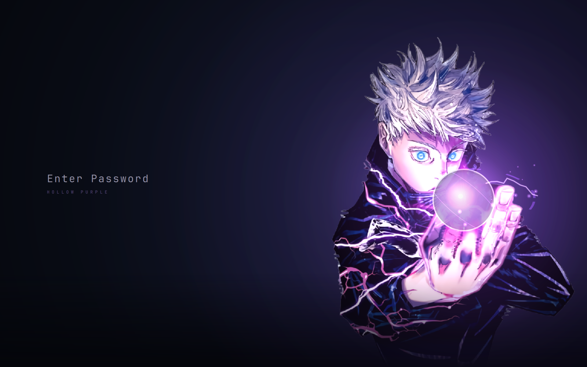
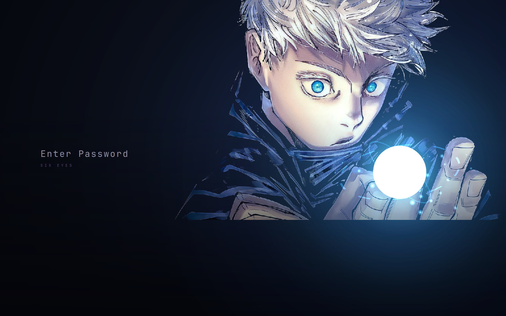

# Gojo for Omarchy

A lock screen for [Omarchy](https://omarchy.org/) where the password field is
Gojo Satoru's cursed energy sphere: the ring you type into is the orb in his
hand, it charges as you type, and it turns red and recoils when the password is
wrong.

One of three poses is drawn at random each time the screen locks, and a wrong
password draws a different one. Each pose brings its own energy colour —
Hollow Purple, Cursed Technique, Six Eyes.




## Install

```bash
curl -fsSL https://raw.githubusercontent.com/jorisvilardell/omarchy-gojo/main/lock-plugin/install.sh | bash
```

Or clone the repo and run `./lock-plugin/install.sh` locally — same script,
nothing piped into a shell.

```bash
omarchy-system-lock       # try it
./lock-plugin/uninstall.sh    # put Omarchy's own lock screen back
```

## `Service.qml` is not in this repo

On Omarchy Quattro the lock screen is not hyprlock, it is a Quickshell *service*
plugin split in two:

- `Service.qml` — PAM authentication, the `ext-session-lock-v1` protocol,
  retry and lockout handling. **Never shipped here.**
- `LockView.qml` and what it pulls in — the purely visual layer. That is what
  this repo replaces.

The only supported way to restyle the lock screen is `omarchy plugin clone`,
which forks both files. Shipping a copy of `Service.qml` would freeze it at
whatever Omarchy version it was written against and silently stop receiving
upstream fixes, so `install.sh` clones fresh from *your own* install every time
and overlays the presentational files onto that clone.

Uninstalling takes the same care: deleting the clone is not enough, because
enabling one puts its source id into `disabledPlugins` — `omarchy.lock` would
stay off and the session would end up with **no lock screen at all**. The
script disables the clone, deletes it, then re-enables the source.

## Theme-bound install

The install above is permanent: it stays whatever Omarchy theme is active.
`omatheme.toml` at the root describes the same files as a theme payload, so
[omatheme](https://github.com/jorisvilardell/omatheme) can bind them to a theme
instead:

```bash
omatheme install https://github.com/jorisvilardell/omarchy-gojo
```

Selecting that theme then brings the lock screen in; selecting any other theme
restores Omarchy's own. The manifest defaults to `gojo-infinity`; link it to
another theme with `--theme`:

```bash
omatheme install https://github.com/jorisvilardell/omarchy-gojo --theme gojo-latte
```

This split — one repository for the theme, one for the lock screen and
launcher that go with it — follows
[omarchy-spiderverse](https://github.com/axelfrache/omarchy-spiderverse).

## Layout

```
lock-plugin/
  qml/
    LockView.qml       the view Service.qml drives: text, dots, the input
    LockCanvas.qml     everything drawn: background, artwork, the sphere
    GojoTheme.js       poses, their colours, where the orb sits on each
    assets/            the three cutouts and two wisp textures
  install.sh  uninstall.sh
omatheme.toml          payload manifest, for the theme-bound path
```

Adding a pose means one entry in `GojoTheme.js` and a cutout in `assets/`.
`anchorX`/`anchorY` are fractions of the artwork's box and say where his hand
is, so the orb lands in it rather than floating beside it.

## Artwork

The three Gojo images are fan art collected from the web, included here for a
desktop theme. They are not mine, and no licence is claimed over them — if you
are the artist and want one removed, open an issue and it goes.

The code is MIT.
